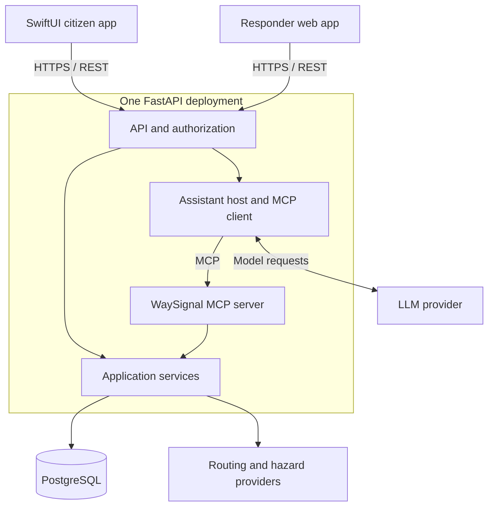

# WaySignal — proposed system architecture

Prepared for Ayush Khadka • TXST Shipaton • September 14, 2026

Working name: **WaySignal**. Proposed repository: `waysignal`. This document is a design, not a report of completed implementation. No new repository or deployment has been created in this planning step.

Build a native SwiftUI citizen app on the useful parts of G-one, with a shared FastAPI backend and a small responder web interface. Focus the submission on **Navigation × Social Media**, supported by **Productivity** through responder tasks.

## 1. Product dependency

| Category | User behavior | Dependency on the other categories |
| --- | --- | --- |
| Navigation | Select a destination and inspect routes against reported hazards | Uses community reports and responder review outcomes to explain route conditions |
| Social Media | Publish location-based hazard posts and see updates relevant to a journey | The selected route determines the feed; responder updates determine report status |
| Productivity | Review incidents, assign work, and track assistance requests | Community reports supply work and location; completed work updates the information travelers see |

Example: a traveler reports a blocked road. It appears as an unreviewed report in the route feed and responder review queue. An authorized responder reviews it; a current, reviewed blockage changes the route assessment. An assistance request can become an assigned task. When the responder later records the road as clear, the report is updated and the next route assessment reflects that evidence.

Completing a help request does **not** automatically clear a road hazard. Those are different facts with different state changes.

The feature dependency is deliberate. Code modules use shared contracts and application workflows, avoiding circular imports between navigation, community, and response code.

## 2. Starting evidence and reuse

Previous G-one documentation identifies React/TypeScript, Python FastAPI, PostgreSQL, REST/polling, citizen and responder interfaces, hazard reports, route guidance, and SOS status. Repository reference from previous work: `ayushkh-txst/jalrakshak-hackrice16`.

The current repository, API schemas, provider coverage, routing algorithm, and deployment health were not verified during this design. Earlier work included backend connectivity failures. Treat each reused function as a candidate until a short running check proves it.

Keep a baseline inventory in the new repository: source repository and commit, reused paths, original contributors/licenses, and new Shipaton work. A new name or repository does not establish eligibility for prior work. Clarify the event's reuse rule before copying it; the supplied screenshots do not resolve that question.

Use separate environment configuration and a separate development database or database namespace for the new project. Do not reuse real incident records as demonstration data.

## 3. Deployment and data flow

Use **one FastAPI deployment with distinct modules**, one PostgreSQL database, a SwiftUI client, and the adapted responder web client. The MCP endpoint and assistant host belong to that same backend deployment for this prototype.

The diagram shows logical components, not a separate deployment for each box. Application services reach the database and external providers through adapters. Normal buttons use REST. Assistant questions use MCP tools that invoke the same application services and enforce the same permissions.

SwiftUI screens depend on view models; view models depend on service protocols; HTTP adapters implement those protocols. A demo adapter can supply clearly labeled fixtures through the same contracts.

MapKit renders the native map. It does not by itself implement our hazard assessment. Validate that the selected routing provider has usable coverage in the existing G-one demonstration region before relying on it. [Apple MapKit documentation](https://developer.apple.com/documentation/mapkit/mapkit-for-swiftui)

## 4. Single Responsibility Principle

Separate modules according to the policy or responsibility that causes them to change. This applies within a deployment; it does not require a separate server for each responsibility. [Robert C. Martin on SRP](https://blog.cleancoder.com/uncle-bob/2014/05/08/SingleReponsibilityPrinciple.html)

| Component | Responsibility |
| --- | --- |
| SwiftUI view | Display screen state and capture user actions |
| Feature view model | Manage that feature's presentation state and loading/error behavior |
| HTTP client | Encode requests, attach session credentials, decode responses |
| API adapter | Validate transport input and map it to an authorized application operation |
| ReportService | Record hazard posts and enforce their review lifecycle |
| RouteAssessmentService | Coordinate candidate routes and hazard evaluations |
| RouteProvider adapter | Obtain route geometry and duration from one provider |
| HazardPolicy | Evaluate one type of hazard under explicit rules |
| AssistanceService | Own help-request creation, assignment, and progress |
| Repository adapter | Read and persist records |
| AssistantService | Manage model interaction and permitted tool use |
| MCP adapter | Describe tools and translate tool calls into application operations |

Authorization belongs at the application boundary shared by REST and MCP. An MCP entry point must not bypass checks because an HTTP controller normally performs them.

## 5. Open/Closed Principle

Choose extension points for the changes we reasonably expect. Add an implementation and register it at startup while preserving the core service contract. Corrections to business rules still require normal maintenance. [Robert C. Martin on OCP](https://blog.cleancoder.com/uncle-bob/2014/05/12/TheOpenClosedPrinciple.html)

| Stable contract | Initial implementation | Future extension |
| --- | --- | --- |
| RouteProvider | Adapter for G-one's verified routing provider | Another provider adapter |
| HazardPolicy | Reviewed-closure policy using explicit status and freshness | Additional flood or other hazard policies after data validation |
| ReportRepository | PostgreSQL persistence | In-memory fixture adapter for isolated tests |
| Mobile ReportService protocol | REST client | Clearly labeled local demonstration implementation |

For example, RouteAssessmentService receives a list of HazardPolicy implementations. Each returns a typed finding with a report ID, affected geometry, reason, timestamp, and disposition. Adding a supported hazard type adds a policy and startup registration, rather than editing SwiftUI views, MCP handlers, and route orchestration together.

Keep the first version small: one real provider and the policies needed for the demonstration. Avoid speculative plugin loaders or abstractions for every class.

## 6. MCP's specific role

MCP means **Model Context Protocol** in this design. It provides the connection between an AI host, its client, and a server exposing tools. It is distinct from SRP/OCP and does not replace application architecture or the ordinary mobile API. [MCP architecture](https://modelcontextprotocol.io/docs/learn/architecture)

Use a supported official SDK and pin compatible client/server versions when implementing. Use Streamable HTTP for the authenticated internal MCP endpoint. The host discovers and calls actual MCP tools; a collection of ordinary Python functions alone is not an MCP integration.

| Proposed MCP tool | Purpose | Shared service |
| --- | --- | --- |
| `assess_route` | Return route options, findings, coverage limitations, and source timestamps | RouteAssessmentService |
| `list_route_reports` | Return recent public reports relevant to a selected route | ReportService |
| `get_assistance_status` | Return an authorized caller's request status | AssistanceService |

Example question: “Why is this route flagged, and what is the status of my help request?” The assistant calls the route/report and status tools, then explains their structured results. It must retain report identifiers and timestamps and must not invent a route, a responder assignment, or a safety guarantee.

The first MCP tools are read-only. The citizen creates requests through an explicit form submission; responders change status through their dashboard. This keeps the important writes concrete and reviewable. Tool contracts and user control follow the MCP tools model. [MCP tools specification](https://modelcontextprotocol.io/specification/latest/server/tools)

Use scoped identity issued for the MCP endpoint and derived from the authenticated user; the model cannot select its own actor, role, or arbitrary request owner. Enforce request ownership and responder scopes in the services. Keep the endpoint private to the host for this prototype. Restrict tool names, validate inputs, bound tool calls, and treat report text as data rather than model instructions.

The mobile app receives an answer plus source references and appropriate data status. If the assistant/model fails, map, reports, and direct assistance controls remain usable. If only tool connectivity is demonstrated, describe it as an MCP integration check, not as a working assistant.

## 7. Route assessment and freshness

1. Obtain candidate route geometries from the verified provider.
2. Load geographically relevant reports with source, review status, observation time, and expiry.
3. Evaluate intersections against current, reviewed closure geometry. Reject candidates intersecting those closures. Keep unreviewed or expired evidence distinguishable and show the appropriate uncertainty.
4. Rank remaining candidates using explicit application rules and return reasons and evidence IDs. If the provider cannot produce an alternative, report that limitation.
5. If every candidate is excluded, return no supported route. Do not draw a fabricated route or equate absence of reports with proof of safety.

Assessments include `generated_at`, `data_status`, report IDs, and coverage information. Distinguish live, cached, demo, and unavailable data. Weather forecasts or map elevation alone do not establish a verified flood boundary. Use existing reviewed/demo closures for the first demonstration.

While relevant screens are open, poll approximately every 10–15 seconds and refresh immediately after successful writes. A newer hazard update prompts reassessment of the current route. Avoid introducing background push delivery into today's critical path.

## 8. Proposed API contracts and records

These are proposed endpoints. Inspect G-one's OpenAPI schema before choosing final paths or copying handlers.

| Endpoint | Operation |
| --- | --- |
| `POST /api/v1/auth/login` | Establish an authenticated session |
| `GET /api/v1/reports` | Read filtered public reports for a route/area |
| `POST /api/v1/reports` | Create a hazard report |
| `PATCH /api/v1/reports/{id}/review` | Authorized responder records review outcome |
| `POST /api/v1/routes/assess` | Obtain candidate routes and hazard findings |
| `POST /api/v1/assistance` | Create a help request with a retry-safe request key |
| `GET /api/v1/assistance/{id}` | Read an authorized request's status |
| `GET /api/v1/assistance` | Authorized responder lists the task queue |
| `PATCH /api/v1/assistance/{id}` | Authorized responder assigns or advances a task |
| `POST /api/v1/assistant/messages` | Ask the assistant using server-side MCP integration |
| `/mcp` | SDK-managed, authenticated MCP transport endpoint |

Reuse existing validated schemas where practical. Proposed conceptual records:

- **User:** identity and citizen/responder role.
- **HazardReport:** type, geometry, author, observation time, review status, expiry, source, and demo flag.
- **ReportUpdate:** report ID, actor, status/outcome, timestamp, and note.
- **AssistanceRequest:** owner, private location, need, optional report link, assignee, state, and timestamps.
- **AssistanceEvent:** request ID, actor, transition, timestamp, and note.
- **RouteAssessment snapshot:** caller-scoped ID, route geometries, report references, generation time, data status, and expiry. This gives the map and assistant a consistent assessment to reference; it may use a short-lived cache rather than a permanent table.

Assistance states: requested → assigned → in progress → completed, with defined cancellation transitions. Report states: unreviewed → reviewed active or rejected; reviewed active → resolved or expired. Review and transition rules require explicit authorization. Preserve history rather than silently overwriting facts.

Use a transaction for state changes and their audit events. Use idempotency for retried creation requests and version checks for conflicting responder edits. Public report responses exclude private help-request locations and contact details. Store mobile session credentials in Keychain and provider/model secrets only in server configuration.

## 9. Proposed repository layout

| Path | Contents |
| --- | --- |
| `ios/WaySignal/` | Xcode project and SwiftUI application |
| `ios/WaySignal/Features/` | Map, Community, Assistance, Assistant |
| `ios/WaySignal/Core/` | Models, networking, location, service protocols, session handling |
| `backend/app/api/` | FastAPI routes and transport schemas |
| `backend/app/application/` | Authorized services and workflows |
| `backend/app/domain/` | Models, policies, and interface contracts |
| `backend/app/infrastructure/` | PostgreSQL, routing, hazard-source, and model adapters |
| `backend/app/mcp/` | MCP server tools and host client integration |
| `backend/tests/` | Contract, permission, route-policy, and workflow checks |
| `responder-web/` | Selected, adapted G-one responder interface |
| `docs/` | Architecture, demo steps, reuse inventory, and submission content |
| `.env.example` | Required configuration names with blank/example values |

Import the relevant G-one baseline in a clearly attributed commit, then commit native app work, shared services, MCP, and integration changes separately. Preserve license obligations and contributor credit. Keep secrets, local environments, and build outputs out of the public repository.

## 10. Build order and acceptance gates

Time budgets are provisional and assume a compatible Mac/Xcode setup and reusable backend functions. Protect the final 90 minutes for the presentation/video and leave submission buffer.

| Stage | Target budget | Evidence needed to advance |
| --- | --- | --- |
| Baseline check and setup | 30 minutes | Xcode app launches; backend/database connect; actual provider and reuse inventory identified |
| Native map and report flow | 90 minutes | Swift app reads reports, submits one, and displays persisted data |
| Category dependency | 90 minutes | Responder review changes route findings; task updates appear correctly |
| MCP assistant slice | 60 minutes | Real tool discovery/call plus a source-backed in-app answer |
| Integrated verification | 60 minutes | Complete demo flow and important failure cases pass |
| Storytelling and submission | 90 minutes | Public repo, README, screenshots/video, Adobe Express template presentation |

This is a roughly seven-hour target before buffer, not a promise. If baseline routing is incomplete, scope route warnings honestly instead of claiming rerouting. If time slips, cut attachments, voice, background notifications, analytics, and extra providers before cutting the core category dependency or submission preparation.

Meaningful checks: a citizen cannot review reports or access another citizen's private request; a current reviewed closure changes route findings; missing data is not rendered as safe; a duplicate request retry creates one record; a responder update reaches the client; REST and MCP apply the same access rules; an assistant outage leaves direct actions functional. Verify actual iOS builds on the Mac, not just source generation in another environment.

## 11. Demonstration

Use one existing geographic region with conspicuously labeled synthetic incident fixtures and real map geometry where available.

1. A citizen opens a destination and sees the reports relevant to that route.
2. The citizen submits a demo blockage; it appears as unreviewed and enters responder review.
3. The responder marks it reviewed active. The route assessment shows the affected segment and evidence; show an alternative only if one was actually obtained and assessed.
4. The citizen asks why the route is flagged. Show the assistant using real MCP tool results.
5. The citizen submits an assistance request. The responder assigns it; the citizen sees the returned status.
6. If time permits, show a separate reviewed resolution of the blockage and the next route assessment update.

Describe the new contribution accurately: a SwiftUI client, route-linked community workflow, shared services with explicit extension points, and MCP-backed explanations. Distinguish reused G-one work, newly completed work, and proposed future features in both the README and Adobe Express presentation.
