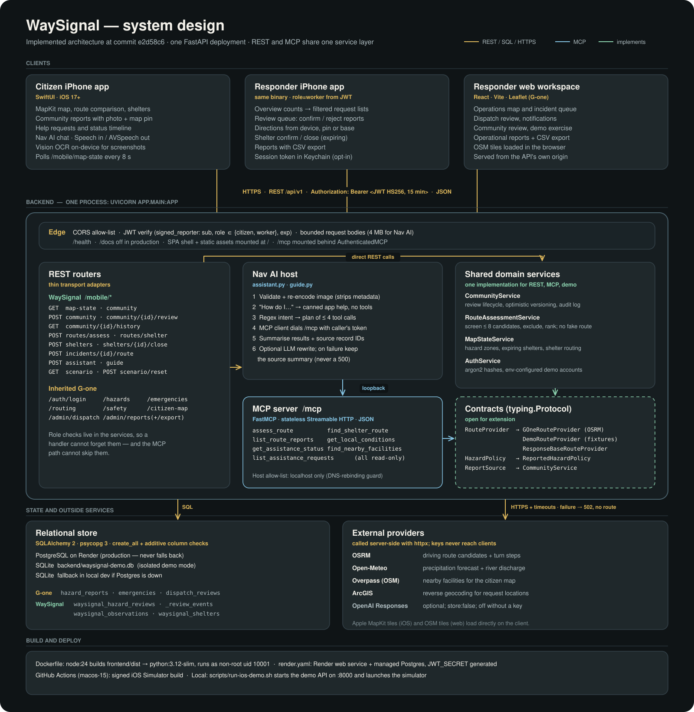
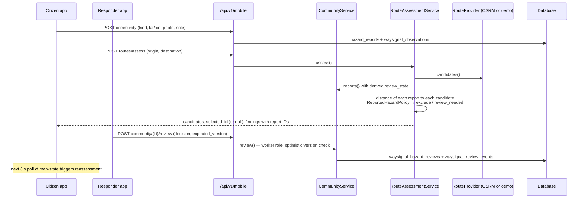
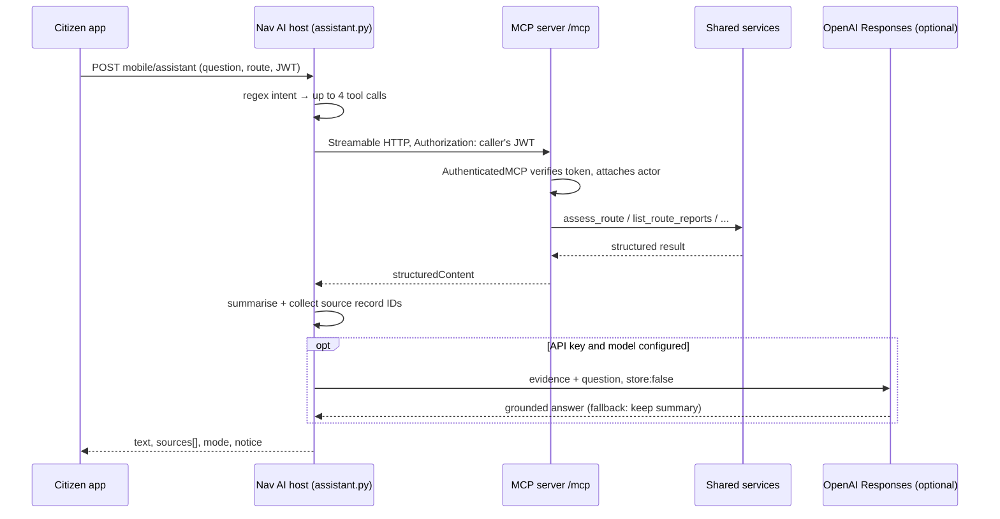

# WaySignal system design

This describes what is implemented at commit `e2d58c6`. The earlier [proposed architecture](../design/WaySignal-System-Architecture.md) was written before the build; where the two differ, this document follows the code.

Regenerate the diagram with `python docs/diagrams/generate_waysignal_system_design.py`.

## The shape in one paragraph

Three clients (citizen and responder modes of one SwiftUI app, plus the inherited G-one React workspace) talk to a single FastAPI process over HTTPS with a short-lived JWT. That process serves the REST API, the built web app, and an MCP server mounted at `/mcp`. Nav AI runs in the same process and reaches its own `/mcp` endpoint over loopback, forwarding the caller's token. REST handlers and MCP tools both call the same domain services, so a route decision or an access check cannot differ between a button tap and a Nav AI answer.

## Flow 1: a report changes a route

Things worth knowing:

- Floods, blocked roads and debris exclude a candidate while review is still pending. Review can confirm the exclusion or reject the report, which makes the corridor eligible again.
- If every candidate is excluded, `selected_id` is `null` and the app shows no route rather than the least-bad one.
- Report buffers are 60 m (120 m for flooded roads), widened by reported GPS accuracy up to 250 m. The same radius draws the map circle and screens the route.
- Reviews older than 24 hours become `expired` and stop counting as confirmed evidence.

## Flow 2: Nav AI answers "why this route?"

The model never chooses the actor or role; those come from the verified token. All seven tools are read-only, so Nav AI can explain records but cannot submit reports or dispatch anyone.

## Design decisions

| Decision | Why | Cost |
|---|---|---|
| One deployment, logical modules | Hackathon scope; one Render service and one database | Nav AI and MCP share CPU and failure domain with the API |
| MCP over loopback instead of direct function calls | A real MCP client/server boundary with the same auth check as REST | An extra HTTP hop per tool call |
| Tool selection by regex, not by the model | Predictable, testable, and works with no model key | Misses questions phrased outside the patterns |
| `RouteProvider` / `HazardPolicy` protocols | Demo, live and responder-base routing swap without touching views or MCP | Three providers to keep behaviourally consistent |
| Polling every 8 s | No push infrastructure needed | Up to 8 s staleness; battery and request cost |
| Additive WaySignal tables beside G-one tables | G-one baseline stays intact and attributable | Two report models joined at read time |

## Known gaps found while mapping this

These are observations from reading the code, not verified against a live deployment.

- **Nav AI on Render.** `MCP_INTERNAL_URL` defaults to `http://127.0.0.1:8000/mcp/`, but the container listens on `$PORT` (10000 by default) and `render.yaml` does not set `MCP_INTERNAL_URL`. A Render deploy would likely return 503 from Nav AI until that variable points at the real port.
- **`render.yaml` is still G-one's.** It deploys branch `feature/login-page-ui` under the service name `g-one-app`. This repository's default branch is `main`.
- **Default demo passwords.** `config.py` ships known passwords for the two primary demo accounts. `render.yaml` marks them `sync: false`, but nothing stops the app starting with the defaults if they are left unset in production.
- **Users live in memory.** Accounts are built from environment settings at startup; there is no user table, sign-up or password change.
- **No push, no offline.** Freshness depends on the 8 s poll while the app is in the foreground.
